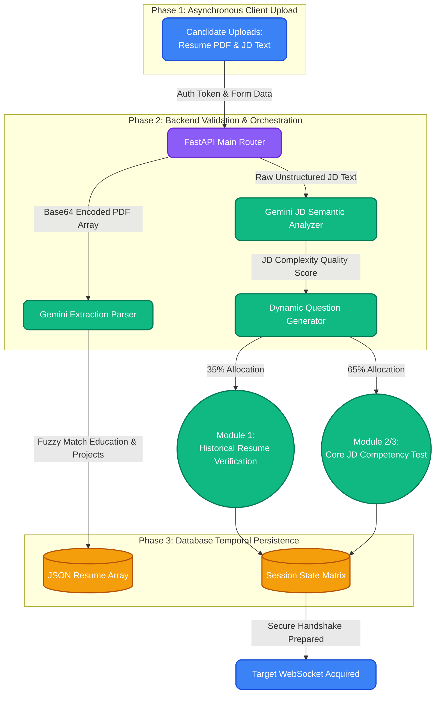
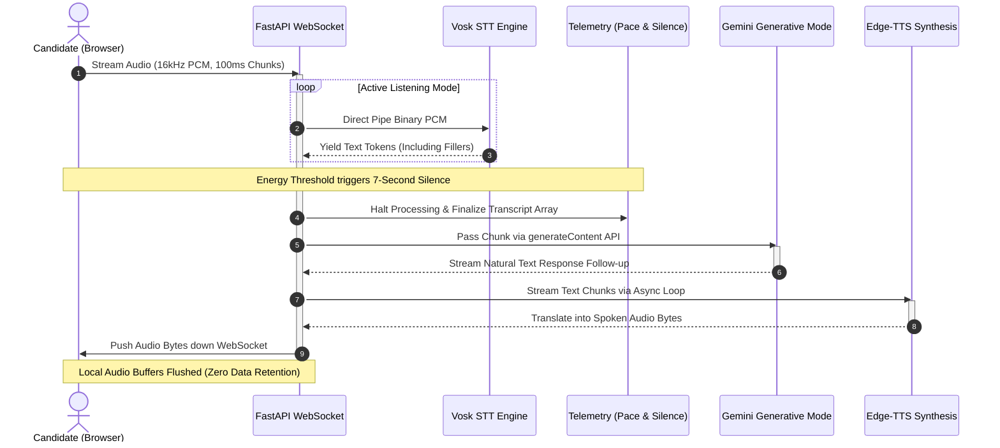
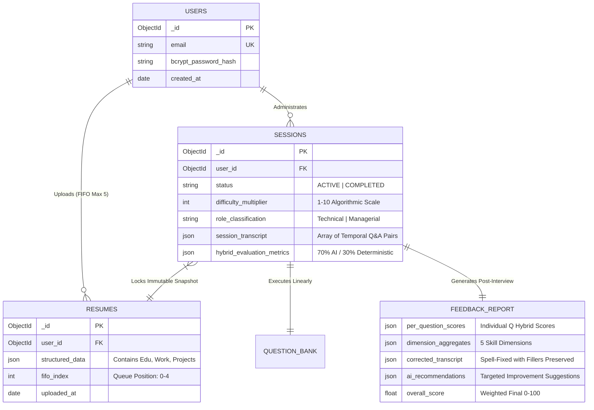
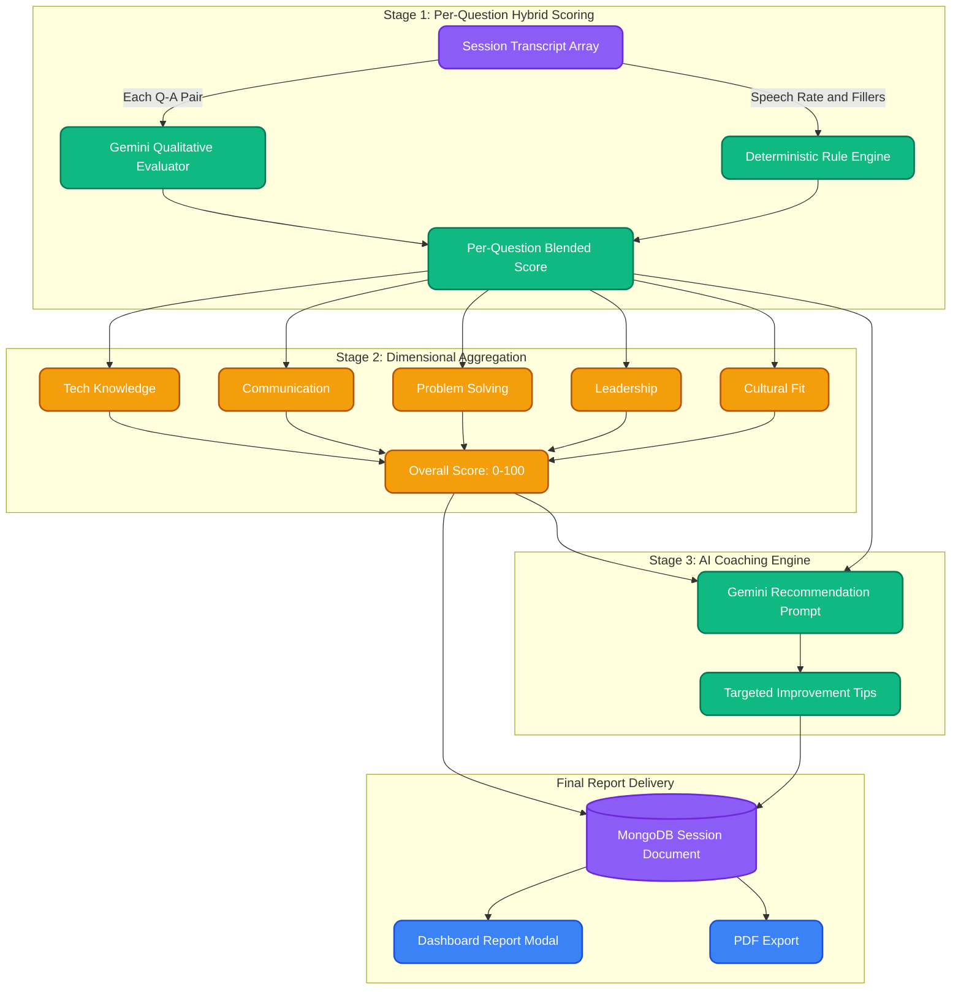

# MockMate AI — Research Paper Diagrams

> This file contains all Mermaid textual diagrams used in the research paper.
> Use these to regenerate or edit diagrams in any Mermaid-compatible tool.

---

## Figure 1: Session Initialization Workflow

---

## Figure 2: Real-Time Voice Pipeline Sequence Diagram

---

## Figure 3: Database Entity-Relationship Model

---

## Figure 4: Feedback Report Generation Pipeline

