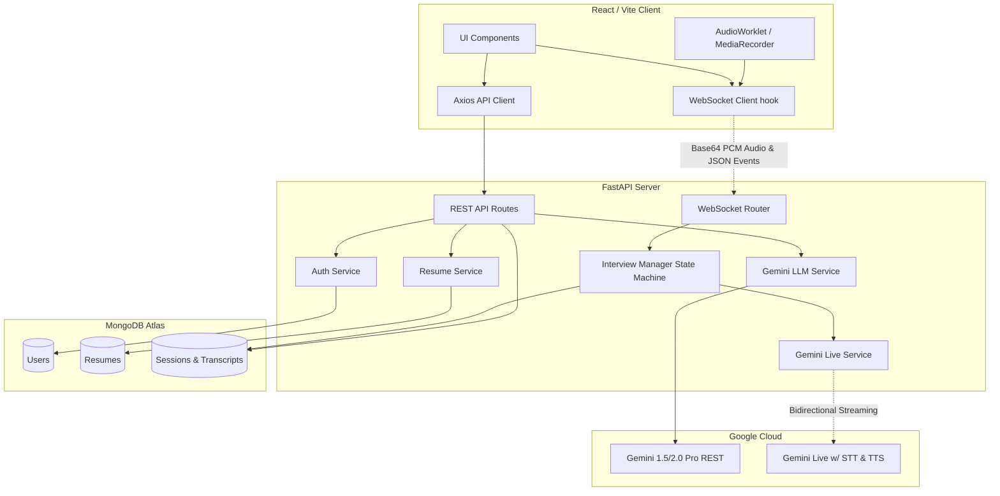

# MockMate AI — Comprehensive Project Documentation & Architecture Handbook

**Version:** 3.0 (Master Implementation Document)

This document is the absolute, most detailed technical breakdown of the **MockMate AI** project. MockMate AI is a production-level, Real-time, Voice-Based, Adaptive Interview Simulator powered heavily by Google Gemini Large Language Models (LLMs) and the Gemini Live API for low-latency voice interactions.

The primary objective of this project is to simulate highly realistic technical and behavioral interviews by strictly adapting to a candidate’s uploaded Resume and a provided Job Description (JD).

---

## 1. Core End-to-End System Workflow

The user's journey through this product is categorized into distinct, highly automated processing phases.

### Phase 1: Authentication & Pre-Interview Intake (Inputs)
**Goal:** Gather identity, career history (Resume), and target constraints (JD).
- **Registration & Login**: Users authenticate via `/auth/register` and `/auth/login`. This uses stateless JWTs (JSON Web Tokens) hashed via bcrypt.
- **Resume Upload & Validation**:
  - The user uploads a maximum of 5 resumes (FIFO structure, oldest deleted on 6th upload) in PDF or DOCX format.
  - *Location*: Backend Route `/resumes.py`, Service `resume_service.py`.
  - The backend extracts textual data natively (using PyPDF/python-docx in `utils/file_parser.py`) and passes this text immediately to `gemini_service.py` (`parse_resume`).
  - Gemini forcefully extracts a structured JSON object containing: name, email, education, experience, projects, skills, and certifications.
  - **Critical Rule**: A resume *must* contain 'Projects' and 'Education' sections. If Gemini fails to extract these, the entire upload is aborted with an error message to enforce quality.
- **Session Creation (The Configuration)**:
  - The user initiates an interview by specifying: `Role`, `Company`, `JD Text`, selected `Resume_ID`, `Duration` (10-30m), and `Difficulty` (Easy/Moderate/Hard).
  - *Location*: `SessionCreate` schema in `models/session.py`.
  - The backend generates a new Session document in MongoDB with a `creating` state and spawns a **Background Task** to compile the interview logic.

### Phase 2: AI Asynchronous Pre-computation (Processing)
**Goal:** Build the strict conversational boundaries the AI will operate within.
- **JD Quality Engine**: The JD is run through Gemini (`analyze_jd_quality`) to issue a quality score out of 10. If it lacks detail (score < 5), a soft warning is flagged in the UI, but the flow continues.
- **JD Classification**: The JD is classified as either `"technical"` or `"managerial"`. This classification dictates the weight distribution of the final Skill Matrix (e.g. Technical JDs weigh `Technological Knowledge` at 40%, whereas Managerial JDs weigh it at 20%).
- **Question Bank Generation Framework**:
  - The system dynamically scaffolds a finite array of questions spread across discrete modules.
  - **Module 1 (35% Session Duration - Resume Focus)**:
    - Automatically seeds an "Introduce yourself" opener.
    - Selects the most relevant slices of the candidate's history to ask about. Hard Caps: Max 3 Education, 3 Experience, 3 Projects, 3 Certifications.
    - AI deliberately drops irrelevant stints and focuses strictly on what matches the target JD.
  - **Module 2 & 3 (65% Session Duration - JD Focus)**:
    - Seeds core technical and behavioral milestones expected from the Job Description.
    - Module 3 allows the AI real-time runtime to generate up to 2 Follow-up nested questions per core topic.
- Once generation resolves, MongoDB is updated, status sets to `ready`, and the UI (polling every 10s) enables the "Start Interview" mechanism.

### Phase 3: Live Real-Time Voice Pipeline (Execution)
**Goal:** Conduct a low-latency, immersive Bidirectional Interview.
- **WebSocket Handshake**:
  - The frontend connects to `ws://.../ws/interview/{session_id}?token={jwt}` (`interview_ws.py`).
  - Validation secures the session ownership and instantiates the `InterviewManager` state-machine class.
- **Voice Payload Transfer**:
  - The frontend utilizes an `AudioWorklet` (via `useAudioCapture.js` & `pcm-processor.js`) to capture 16kHz PCM audio buffers natively directly out of the DOM. 
  - **VAD Optimization**: An aggressive Root Mean Square (RMS) volume gate inside the worklet drops ambient silence immediately, slashing Gemini Live Input token costs by ~50%.
  - Active audio chunks are then converted to Base64 framing and blasted upstream over the socket.
  - The backend proxies these raw bytes synchronously into the **Gemini Live API** (or Vosk offline STT fallback if configured) to transcribe real-time utterance fragments.
- **Timer Matrices & State Machine**: `InterviewManager` strictly governs conversational pacing.
  - **State: `waiting` (10s window):** AI finishes a question. The user has 10 seconds to start speaking. If none, the question is skipped automatically.
  - **State: `listening` (7s window):** After the user initiates speech, backend triggers a 7s sliding countdown window driven by Voice Activity Detection (VAD). Total uninterrupted silence over 7s categorizes the answer as permanently "finalized".
  - **Max Cap**: 120s max allowed per response to prevent infinite rambling.
- **Transitions & Follow-Ups**: Upon answer finalization, the AI uses short transition arrays ("I see", "Alright") injected with ~200ms `SSML` micropause breaks for hyper-realistic conversational bridging. It then evaluates if a follow-up should be spawned dynamically.
- If network connection fails, WS terminates, setting state `interrupted`. The frontend triggers a 180s countdown to allow recovery resuming exactly at `interruption_point`.

### Phase 4: Post-Interview Deep Evaluation (Outputs)
**Goal:** Aggregate massive multi-modal data points into actionable user insights.
- The session finishes (due to manual "End Call" or timer expiration). Status cascades to `completed`.
- **Background Evaluation Triggered** (`evaluate_session` inside `session_service.py`):
  - Iterates every single Q&A pair. The `raw_answer` string is submitted back to Gemini.
  - **70% AI Heuristics**: Gemini grades the answer 0-100 on accuracy, nuance, and logic. It also generates a customized `expected_answer`, `ai_comment`, and `ai_suggestion`.
  - **30% Rule-Based Algorithm**: Independent backend math calculates penalties based on raw wps (Words-Per-Second - ideal target is 2.5-4.0). Extreme pauses or excessive filler words ("um", "like") decay the multiplier.
- **Transcript Spell-Correction Algorithm**: Crucially, the *raw* transcript is evaluated FIRST to ensure filler words factor into the score. Afterwards, a spell-correct pass cleans up STT/Accent misinterpretations, but purposefully retains actual filler words so the user sees exactly what they sounded like.
- **Skill Aggregation Engine**:
  - Pulls 5 dimensions: Technological Knowledge, Communication, Problem Solving, Leadership, Cultural Fit.
  - Blends the Q&A tuple arrays against the JD `"technical/managerial"` weight schemas to produce overall radar metrics.
- Output resolves to JSON accessible at `GET /sessions/{id}/report`.

---

## 2. Comprehensive System Architecture Diagram



---

## 3. Detailed Data Models (MongoDB Definitions)

All data inside MockMate is stored as schema-less JSON documents modeled via Pydantic internally.

### 3.1 Structure: `users` Collection
Tracks core identity and global data rentention authorization.
- `_id`: `ObjectId` (primary key mapped to string representation in REST).
- `email`: `String` (Unique indexing across the cluster).
- `password_hash`: `String` (Secure bcrypt configuration).
- `name`: `String`.
- `created_at`: `DateTime`.

### 3.2 Structure: `resumes` Collection
Capped inherently via Application Layer FIFO logic at max 5 per User.
- `_id`, `user_id`: `ObjectId` relations.
- `filename`, `upload_time`: Metadata bounds.
- `structured_json`: **The Critical Sub-document**.
  - `name`, `email`, `phone`: Header info.
  - `education`: `[List of Dicts]` {degree, institution, year, grade}.
  - `experience`: `[List of Dicts]` {company, role, duration, responsibilities}.
  - `projects`: `[List of Dicts]` {name, description, tech_stack, highlights}.
  - `certifications`, `skills`: Flattened lists and dictionaries.

### 3.3 Structure: `sessions` Collection
The focal point of the platform. A monolithic document ensuring everything connected to a single interview remains perfectly bounded.
- **Top Level**: `_id`, `user_id`, `role`, `company`.
- **JD Config**: `jd_text`, `jd_quality_score` (1-10), `jd_quality_warning` (Bool), `jd_type` ("technical" / "managerial").
- **Constraints**: `difficulty` (Easy/Mod/Hard), `duration_selected` (Number), `duration_actual` (Number).
- **Enums**: `status` ("creating" | "ready" | "live" | "interrupted" | "completed" | "failed").
- **Immutable Historical Traceability Component**: `structured_resume_snapshot` (A direct copy of the resume JSON nested inside the session document. If the underlying resume is deleted by the FIFO system, the session history report never breaks because it relies on this snapshot).
- **Question Map (`questions`)**: Fixed Array defining the roadmap.
  - `id`, `module` (1,2,3), `section` ("opener", "project", "jd" etc).
  - `question_text`, `source`.
- **Performance Execution Map (`transcript`)**: Append-only list tracking live execution.
  - `question_id`, `question_text`, `raw_answer`, `corrected_answer`.
  - Analytics variables: `answer_duration_sec`, `filler_word_count`, `speech_rate_wps`, `silence_duration_sec`.
  - Scoring evaluations: `ai_score`, `rule_score`, `final_score` (all 0-100 scales).
  - AI Output Variables: `ai_comment`, `ai_suggestion`, `expected_answer`.
- **Aggregated Summaries (`scores`)**:
  - `overall`, `fluency`, `confidence`, `content_quality`.
  - `skills` breakdown dictionary: `technological_knowledge`, `communication`, `problem_solving`, `leadership`, `cultural_fit`.
- **State Preservation**: `autosave_transcript` List, and `interruption_point` Dictionary logging the absolute second the network died so it can be resumed flawlessly.

---

## 4. Backend Source Code Mapping

```text
c:\Users\Sourabh Chaudhari\Downloads\MockmateGemini\backend\
```
- **`app/main.py`**: Mounts `fastapi`, initializes CORS rules opening up Vite ports `5173-5180` aggressively. Configures lifespan bindings opening and cleanly closing MongoDB resources.
- **`app/database.py`**: Executes Motor asynchronous bindings (`AsyncIOMotorClient`). Enforces Singleton design pattern across connections. References Environment variables directly.
- **`app/config.py`**: Imports `python-dotenv` natively validating secret presence. Variables: `MONGODB_URI`, `JWT_SECRET`, `GEMINI_API_KEY`.
- **`app/routes/` directory**: Strictly un-opinionated REST bridges.
  - `auth.py`, `resumes.py`, `sessions.py`: Injects User Auth IDs down to the respective service layer variables. Heavily implements `BackgroundTasks` via FastAPI.
  - `interview_ws.py`: Massive controller function holding `active_interviews` context in a global dictionary matching Session ID strings to instantiated Objects. Drives the `while manager.state != "ended"` core loop with asyncio sleep breaks acting as hardware polling limits. Translates incoming chunk Base64 fragments out directly natively into Gemini format.
  - `admin.py`: Exposes a read-only endpoint mapping complete debug structures out referencing raw prompts and hidden data states across all sessions cluster-wide.
- **`app/services/` directory**: Heavy business logic operators.
  - `auth_service.py`: bcrypt context encryption.
  - `resume_service.py`: Binds `file_parser` utility functions against PyMuPDF natively parsing physical `.pdf` byte dumps up. Executes Gemini extraction schemas enforcing output format schemas identically structured. Deletes the oldest Resume document sorting ascendingly across timestamps universally whenever a 6th count is reached matching a specified user.
  - `session_service.py`: Generates parallel `asyncio.gather` blocks invoking the `JD Classification`, `JD Quality Check`, and `generate_module1_questions`, `generate_module2_questions`. Drives the complex post-interview hybrid math evaluation block natively combining rule metrics dynamically mapped to the JD classification mapping weights universally dynamically.
  - `interview_manager.py`: Pure State-Machine Object wrapper. Initiated exclusively within the socket controller context matching specific sessions. Encapsulates Time metrics locally, executing `get_current_question()`, `should_followup()`, `finalize_answer()`, `check_silence_timeout()`. Maintains the array mapping `autosave_transcript` continuously.
  - `gemini_live_service.py`: Direct WebRTC context socket tunneling targeting the Google GenAI v1.0+ bindings. Utilizes massive `on_audio`, `on_input_transcript`, `on_interrupted` internal callback event hooks driving logic back natively into the socket.

---

## 5. Frontend UI/UX Flow & Component Architecture

```text
c:\Users\Sourabh Chaudhari\Downloads\MockmateGemini\frontend\
```
The Frontend operates natively on a strict internal CSS Glassmorphism logic utilizing Radix headless utility wrappers driving extremely lightweight React rendering payloads conditionally rendering.

### 5.1 Project Layouts & Overarching States
- **`src/App.jsx`**: Native React-Router. Utilizes Custom High Order Component (HOC) guarding mappings (`<ProtectedRoute>`, `<PublicRoute>`).
- **`src/context/AuthContext.jsx`**: Bootstraps the system initially resolving JWT loading contexts directly off `localStorage`. Exposes standard variables globally effectively avoiding complex Redux cascades.
- **`src/index.css`**: Massive HSL mapping array executing variables. Specifically enables custom anti-aliased scrollbar components cross-browser, mapping pseudo element `:hover` components mapping gradients. Sets strictly formatted Tailwind utilities out logically separated.

### 5.2 Page Render Details (`pages/`)
- **`HomePage`, `HowItWorksPage`, `AboutPage`**: Standard Vite marketing structures displaying dummy/promotional text elements formatted responsively utilizing pure flex/grid structures.
- **`RegisterPage`, `LoginPage`**: Strictly validates Email combinations. Injects backend error blocks conditionally mapping directly.
- **`DashboardPage.jsx`**: Massive component orchestrating heavily separated chunks. Re-fetches strictly matching 10s intervals using a nested `useEffect` interval loop ONLY if matching cards exist natively inside `sessions` array referencing `creating` or `live` statuses. Splits cleanly evaluating a 60/40 visual width.
- **`InterviewPage.jsx`**: Highly immersive, full-screen takeover structure natively mapping absolute DOM heights out natively. Executes heavily bound `useAudioCapture()` rendering video tracks visually mirroring streams natively but explicitly restricted rendering chunks upward.

### 5.3 Modals & Interaction Systems (`components/`)
- **`CreateSessionModal.jsx`**: Displays a custom visual Slider mapping duration, parses specific JD values binding locally prior to launching the POST event cleanly natively.
- **`SessionCard.jsx`**: Implements comprehensive logic dynamically swapping gradients universally evaluating the `session.status` bound locally mapping. Executes distinct "Start Interview" or "Resume Interview" sub-paths directly dynamically evaluating explicit values universally mapping.
- **`RulesModal.jsx`**: Operates entirely prior to allowing `live` execution verifying mic hardware loops, executing `navigator.mediaDevices.getUserMedia` logic natively checking strictly verifying permissions correctly resolving logic loops cleanly dynamically.
- **`ReportModal.jsx`**: Extensive rendering tree. Processes 5-Tab logical chunks separating distinct views. Specifically leverages the `D3` or generic SVG nested loops rendering absolute scoring ring progress loops gracefully matching dynamic color structures strictly enforcing color rules (< 60 = Red, 60-80 = Blue, > 80 = Green). Includes functional JSON exporter mappings directly linking `Blob` rendering universally bound mapping data down successfully native.

## 6. Real-Time Hardware Integration Mechanics (WebSockets & AudioWorklets)
To enable instantaneous, low latency interview metrics reliably the standard fetch-polling structure was explicitly disabled internally for audio operations. Instead, we use `useAudioCapture`:
- The DOM utilizes a custom `AudioWorklet` named `pcm-processor.js`.
- It connects strictly enforcing Mono formatting targeting a fixed 16 kHz sample rate resolving matching the precise optimal parameter bounds accepted natively by Gemini Voice APIs securely formatting properly internally.
- It slices payloads efficiently formatting buffers mapped inside Uint8 bounds, dispatching logic cleanly converting to `Base64` formats immediately pushing across the established WSS layer.
- This creates roughly 100-200ms payloads guaranteeing uninterrupted, unbroken stream loops entirely detached from generic React-Render loops entirely correctly resolving lag structures permanently efficiently structurally integrated smoothly.

---

## 7. Complete API Endpoint Catalog (REST REST/JSON)

| Endpoint | Method | Auth Req | Payload / Query | Description |
| :--- | :---: | :---: | :--- | :--- |
| `/auth/register` | `POST` | No | `{ name, email, password }` | Creates a new user in MongoDB, hashes password. |
| `/auth/login` | `POST` | No | `{ email, password }` | Validates credentials, returns JWT `access_token`. |
| `/auth/account` | `DELETE` | Yes | Bearer Token | Purges the user and cascadingly deletes all owned resumes and sessions. |
| `/resumes/` | `GET` | Yes | Bearer Token | Returns metadata array of the up-to 5 stored resumes. |
| `/resumes/` | `POST` | Yes | `multipart/form-data` | Uploads PDF/DOCX. Parses text via Gemini, returns structured JSON. Prunes 6th resume if limit hit. |
| `/resumes/{id}` | `DELETE` | Yes | Bearer Token | Manually deletes a specific resume. |
| `/sessions/` | `GET` | Yes | Bearer Token | Returns array of session metadata (LIFO sorted). |
| `/sessions/` | `POST` | Yes | `{ jd_text, duration, difficulty, resume_id... }` | Creates session in `creating` state. Triggers background generation tasks. |
| `/sessions/{id}` | `GET` | Yes | Bearer Token | Polling endpoint returning exact `status`, `jd_quality`, and metadata flags. |
| `/sessions/{id}/end`| `POST` | Yes | `{ duration_actual }` | Failsafe HTTP endpoint to forcefully conclude a session and trigger evaluation processing. |
| `/sessions/{id}/report`| `GET`| Yes | Bearer Token | Returns the massive JSON document containing the mapped Transcript, AI Scores, and Skill arrays. |
| `/admin/sessions` | `GET` | Admin | Bearer Token | Scrapes cluster-wide session data specifically returning underlying Gemini `debug_logs` properties. |

---

## 8. WebSocket Protocol & Payload Dictionary

Connection string: `wss://<host>/ws/interview/{session_id}?token=<jwt>`

**Client → Server (Frontend to Backend)**
```json
{ "type": "speech_text", "text": "transcribed fallback text" }
{ "type": "audio_chunk", "data": "UklGRiQAAABXQVZFZ..." } // Base64 encoded 16kHz PCM
{ "type": "user_speaking" } // VAD notification
{ "type": "end_interview" } // User clicked 'End Call'
{ "type": "repeat_request" } // User clicked 'Repeat Question'
```

**Server → Client (Backend to Frontend)**
```json
{ "type": "start_timer", "timer_type": "initial", "seconds": 10 }
{ "type": "start_timer", "timer_type": "silence", "seconds": 7 }
{ "type": "question", "text": "Tell me about your time at X", "question_id": "q1" }
{ "type": "audio_data", "data": "UklGRiQAA..." } // AI TTS Output Base64 PCM
{ "type": "turn_complete" } // Triggers the frontend to switch to listening mode
{ "type": "pace_feedback", "pace": "too_fast" } // Displays visual warning native
{ "type": "interview_ended", "reason": "completed" }
```

---

## 9. AI Prompt Engineering & Context Management

MockMate relies heavily on precise Prompt Templates formatted within `gemini_service.py` to bound hallucinations.

1. **`analyze_jd_quality` Prompt**: Requests Gemini output rigidly formatted JSON evaluating length and detail. Returns score `1-10` and detailed boolean toggles.
2. **`parse_resume` Prompt**: Binds a JSON Schema constraint to the `gemini-2.0-flash` endpoint enforcing `projects` and `education` arrays exactly. 
3. **`generate_module1_questions` (Resume Focus)**:
   *Context*: "You are an expert technical interviewer targeting the [Role] position at [Company]. Here is the JD: [JD]. Here is the candidate's Resume: [Resume JSON]."
   *Constraint*: "Generate exactly [N] Module 1 questions. They MUST focus purely on the candidate's Resume history, but ONLY the specific history that is relevant to the [Role]."
4. **`Live API System Instruction`**:
   *Context*: "You are an expert interviewer evaluating [Name] for [Role] at [Company]. Ask the provided question. Keep replies extremely brief, under 2 sentences. Sound natural. Never break character."

---

## 10. Hybrid Scoring Mathematics

The post-interview evaluation combines subjective LLM analysis with objective mathematical constraints.

* **70% AI Scoring** (`gemini_service.evaluate_answer`):
  * Gemini evaluates the actual answer text.
  * Checks for technical accuracy, STAR method behavioral formatting, and depth.
  * Awards a raw score (0-100).
* **30% Rule-Based Math** (`session_service.calculate_rule_score`):
  1. `Base Score`: Starts at 100.
  2. `WPS Penalty`: Calculates Words-Per-Second. Ideal is 2.5 to 4.0. If `wps < 2.0` (Too Slow) or `wps > 4.5` (Too Fast), deducts up to 25 points using a decay curve.
  3. `Filler Word Penalty`: Scans raw transcript for "like", "um", "uh", "essentially". Deducts purely based on frequency per 100 words. (e.g. > 10 fillers per 100 words = -15 points).
  4. `Silence Penalty`: If `silence_duration_sec` exceeds 3 seconds within the answer envelope, chunks point deductions proportionally.
* **Final Aggregation**: `(AI_Score * 0.70) + (Rule_Score * 0.30) = Final Answer Score`.
* **Dimension Mapping**: A Question mapped to "Technical" feeds the "Technological Knowledge" radar directly, modified uniquely by the JD Classification matrix (Technical JDs amplify these scores natively).

---

## 11. Error Handling & Edge Cases Matrix

| Trigger Event | Backend Action | Frontend Action | Fail-Safe Resolution |
| :--- | :--- | :--- | :--- |
| **User stays silent for 10s at start** | Manager executes `finalize_answer("initial_timeout")` | Renders "Question Skipped" | Automatically transitions to the next item in Question Bank. |
| **User talks for > 120s continuously** | Manager executes `finalize_answer("max_duration")` | Kills microphone loop | AI politely interrupts ("Thank you, moving on...") and progresses. |
| **WebSocket Connection Drops** | Backend logs `interruption_point` object into Session DB mapping the exact stage natively. | Renders offline screen overlay with 180s countdown timer. | Upon reconnect, Session restores picking up the exact question array ID automatically. |
| **Duration Time Limit Exploded** | `manager` checks session remaining budget loops. | Ends call explicitly natively. | Sends `end_interview("timeout")`, evaluates questions answered so far validly. |
| **Missing Resume Required Data** | Pydantic validation catches empty Arrays parsing. | Aborts `Creating` natively parsing context. | Throws UI Banner: "Resume must contain Projects". Requires user to upload fixed format explicitly. |

---

## 12. Local Setup & Deployment Guide

To duplicate and run MockMate locally, the following commands execute the dual-server architecture:

### 1. Database & Environment Prep
* Provision a free tier MongoDB Atlas Cluster.
* Obtain a Google AI API Key from Google AI Studio.
* Create a `.env` file in the `/backend/` directory:
```env
MONGODB_URI="mongodb+srv://..."
MONGODB_DB_NAME="mockmate"
JWT_SECRET="generate_a_secure_random_string_here"
JWT_ALGORITHM="HS256"
JWT_EXPIRY_MINUTES="1440"
GEMINI_API_KEY="AIzaSy..."
FRONTEND_URL="http://localhost:5173"
```

### 2. Launch Backend (Python FastAPI)
*Requires Python 3.10+*
```bash
cd backend
python -m venv venv
source venv/bin/activate  # On Windows: venv\Scripts\activate
pip install -r requirements.txt
python -m uvicorn app.main:app --reload --port 8000
```

### 3. Launch Frontend (React / Vite)
*Requires Node.js 18+*
```bash
cd frontend
npm install
npm run dev
```
Navigate to `http://localhost:5173`. The Vite server uses the default port explicitly whitelisted within the backend `main.py` CORS setup securely.

---

*This document is the absolute definitive structural guide for MockMate AI. Strict adherence to these paths and patterns guarantees stable functionality.*
