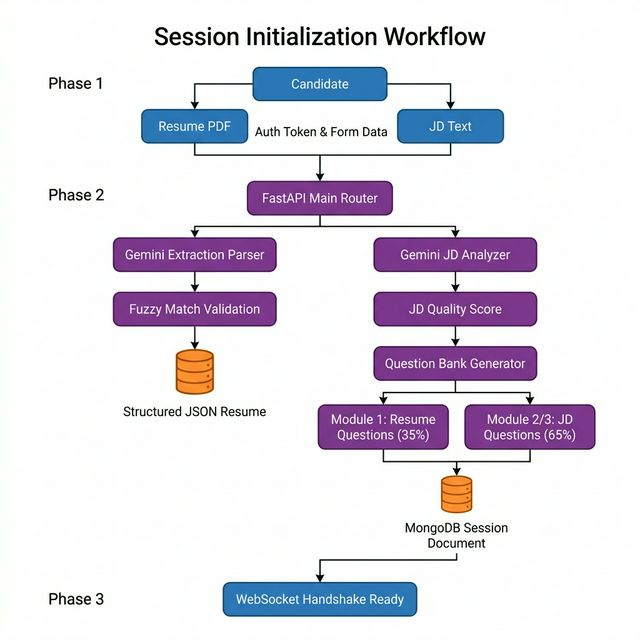
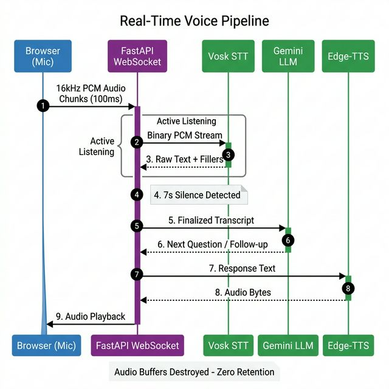
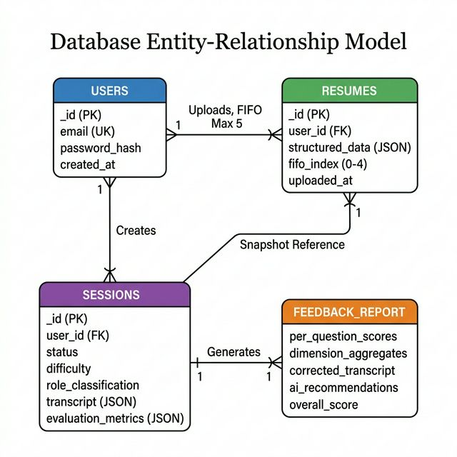
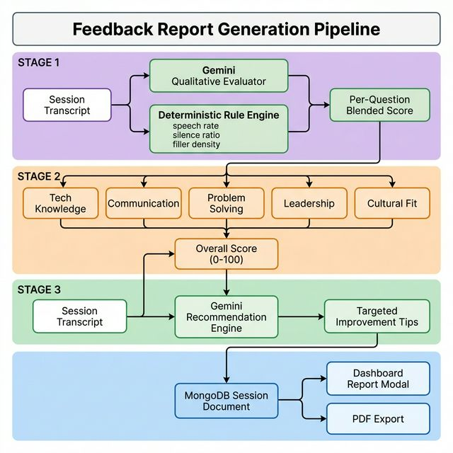

# A Real-Time Adaptive Voice-Based Interview Simulation System Using Large Language Models

**Authors:**  
Prof. Dr. C. A. Ghuge, Dept. of AI & ML, PES's Modern College of Engineering, Pune  
Mr. Sourabh A. Chaudhari, Dept. of AI & ML, PES's Modern College of Engineering, Pune  
Ms. Darshana G. Bedse, Dept. of AI & ML, PES's Modern College of Engineering, Pune  
Mr. Chetan R. Bava, Dept. of AI & ML, PES's Modern College of Engineering, Pune

**Abstract**  
Traditional mock interviews have historically lacked the adaptability, scalability, and interactivity required to effectively prepare candidates for dynamic real-world professional scenarios. We present MockMate AI, a real-time, voice-first interview simulator leveraging advanced Large Language Models (LLMs) and a secure, bidirectional real-time audio streaming architecture. Unlike static questionnaires or pre-recorded video assessments, MockMate dynamically generates prioritized question banks based on deep parsing of candidate resumes and Job Descriptions (JDs), and adaptively generates context-aware follow-up questions sequentially based on the candidate's spoken responses. Furthermore, we introduce a hybrid scoring methodology that calculates candidate proficiency by integrating a deterministic rule-based evaluation system—measuring speech rate, silence intervals, and filler word frequency—with an LLM-driven qualitative analysis. Our proposed software architecture prioritizes user privacy through the implementation of ephemeral audio streaming over WebSockets, minimizing End-to-End latency to achieve 0.8s–2.1s turnaround times, thereby replicating natural conversational pacing without the massive hardware overhead traditionally required for multimodal processing.

## 1. Introduction  

The contemporary job interview process remains one of the most critical and inherently stressful hurdles in professional career advancement. Despite the rise of remote work and digital hiring platforms, the fundamental requirement of an applicant to verbally articulate their experience, demonstrate domain expertise, and exhibit cultural fit under pressure remains unchanged. Interviews are not merely knowledge assessments; they are high-pressure social interactions where candidates are simultaneously evaluated on technical accuracy, communication fluency, structured problem-solving, and behavioral composure—all within a narrow window of real-time verbal delivery. This multi-dimensional evaluation makes interviews uniquely difficult to prepare for through traditional methods.

Unfortunately, current preparation methods available to the general candidate population are often severely inadequate. Candidates typically rely on reading crowd-sourced questions on review platforms such as Glassdoor and LeetCode, practicing in front of a mirror, rehearsing with friends or family members who lack domain context, or engaging with static, text-based AI chatbots that follow rigid decision trees. While these methods may help a candidate memorize specific answers, they fundamentally fail to replicate the conversational depth, the pressure of immediate verbal articulation, the domain-specific follow-up rigor, and the adaptive pacing characteristic of professional human-led interviews. The candidate never truly practices the act of *thinking on their feet* under pressure.

The commercial landscape has attempted to address this gap. Platforms like Pramp, interviewing.io, and Big Interview offer peer-matching or pre-recorded video submissions. However, peer-matching platforms suffer from scheduling friction, inconsistent interviewer quality, and geographical limitations. Pre-recorded video platforms, while asynchronous, strip away the core conversational element entirely—candidates speak into a void without receiving any adaptive follow-up questions that probe the depth of their understanding. Neither category of existing solution delivers what candidates truly need: a private, on-demand, infinitely patient, and deeply adaptive interviewer that responds in real-time to *what they actually say*.

The advent of Large Language Models (LLMs) has catalyzed a paradigm shift in conversational AI, transitioning from classical machine learning text processing into highly adaptable conversational agents capable of sophisticated reasoning, contextual memory, and stateful persona adoption [21]. LLMs can now assume the role of a knowledgeable interviewer, dynamically adjusting their line of questioning based on the quality, depth, and relevance of a candidate's spoken answers. However, utilizing an LLM solely as a text generator inside a chatbox squanders its transformative potential. The real breakthrough lies in coupling LLMs with real-time voice pipelines that allow candidates to *speak* naturally—mimicking the exact modality of a real interview—while the AI listens, evaluates, and responds within human-like conversational latencies.

Recent psychophysiological research strongly validates this direction. Studies on virtual agents demonstrate that well-designed AI interviewers can induce stress levels comparable to those experienced with human interviewers, confirming their effectiveness as immersive practice environments for behavioral and cognitive conditioning [19][23]. Kessassi et al. [23] specifically demonstrated that the perceived social status and attitude of a virtual interviewing agent directly influenced the candidate's stress response, proving that realistic AI personas are not merely a convenience but a psychologically validated training mechanism. Mizuno et al. [19] further extended this finding to professional performance reviews, showing that avatar-mediated feedback can meaningfully reduce anxiety while maintaining evaluative rigor. These findings collectively argue that if an AI can accurately simulate the pacing, pressure, and adaptive behavior of a hiring manager, it offers candidates a repeatable, scalable, and invaluable training ground.

Critically, however, the value of a mock interview is not limited to the conversation itself. Candidates improve only when they receive structured, actionable, and granular feedback after each session. Existing platforms overwhelmingly fail here—most either provide a single numeric score with no explanation, or present a vague summary that offers no clear pathway for targeted improvement. MockMate addresses this gap directly by generating a comprehensive, multi-dimensional Post-Interview Feedback Report. This report is not a simple pass/fail verdict. It breaks down the candidate's performance into five distinct competency dimensions—Technological Knowledge, Communication, Problem Solving, Leadership, and Cultural Fit—each scored independently using a hybrid algorithm that blends LLM qualitative analysis with deterministic, rule-based metrics derived from the candidate's actual speech patterns. The report further includes per-question breakdowns, an AI-generated spell-corrected transcript for self-review, and targeted improvement recommendations identifying specific areas where the candidate can focus their practice.

In this paper, we introduce MockMate AI, a sophisticated, voice-first, privacy-conscious interview simulation platform that unifies three critical capabilities into a single coherent system: (1) adaptive, real-time question generation dynamically aligned to the candidate's resume and the target Job Description, (2) a low-latency bidirectional voice pipeline that preserves natural conversational flow through ephemeral audio streaming, and (3) a comprehensive post-interview feedback and scoring report engine designed to drive iterative candidate self-improvement. We demonstrate how modern real-time data routing architectures, when bridged natively with Generative AI networks, can drastically reduce response latency while providing accurate, actionable behavioral and technical feedback. By combining dynamic job description parsing, rigorous conversational constraints, and a unique hybrid scoring algorithm that mathematically grounds the LLM's inherent subjectivity, MockMate bridges the gap between static resume analysis and the fluidity of natural human interaction.

---

## 2. Related Work / Literature Review

The development of MockMate lies at the intersection of several rapidly advancing domains within artificial intelligence. We contextualize our system by analyzing recent literature across three distinct themes: affective computing in interview simulation, latency optimization in LLM voice pipelines, and the strategic differences between Vector Databases and structured state management.

### 2.1 AI in Interview Simulation and Affective Computing
A substantial volume of recent literature has explored the integration of natural language processing (NLP) into interview evaluation frameworks with the goal of minimizing human bias and standardizing the assessment of candidate responses [6][7][10]. Early systems utilized rigid keyword-matching algorithms, whereas modern systems leverage deep learning. Research by Datta et al. [5] and Vora et al. [9] has focused heavily on utilizing RoBERTa and related transformer models as proxy emotion and confidence classifiers during automated interviews. Furthermore, systems proposed by Likhitha et al. [15] incorporated complex multimodal feedback matrices, utilizing generative AI to map facial tracking and vocal tonality concurrently.

An insightful framework recently proposed by Anonymous [12] detailed hybrid AI-driven models specifically tailored for personalized adaptive learning in interview preparation, while Lee et al. [8] emphasized the pedagogical value of automated coaches dedicated to practicing conversational dynamics rather than purely evaluating them.

MockMate extends upon these approaches conceptually but differs significantly in mechanical execution. Rather than relying solely on black-box affective classifiers—which are often fraught with demographic bias and inconsistent latency—MockMate strictly aligns its adaptive question-generation directly to the semantic interplay between the user-provided Job Descriptions (JDs) and historical professional experiences extracted from resumes. Furthermore, psychological validation regarding stress induction by virtual agents in performance reviews and job interviews [19][23] reinforces MockMate's core design choice: the system is specifically architected to simulate a rigorous, paced conversational environment with strict timers, rather than operating as a relaxed questionnaire.

### 2.2 LLMs, Voice Pipelines, and Latency Optimization
The choice of an underlying foundational AI model heavily dictates a system's capability to process conversational context windows in real-time. Recent comparative benchmarking by Motezacker [2] analyzed GPT-4, Claude 3 Opus, and Gemini 1.0 Ultra. This study explicitly highlighted the native multimodal and sequential generation prowess of the Gemini architecture, which informed our decision to adopt Gemini API pipelines as the primary cognition engine for MockMate. 

However, cloud-dependent architectures introduce financial vulnerabilities at scale. Tyagi et al. [4] provided an extensive cost-benefit analysis concerning on-premise versus cloud-based LLM deployments, arguing that edge-processing or local orchestration reduces operational expenditure exponentially. Motivated by these cost constraints and the need for zero-latency fallback systems, MockMate integrates decoupled, off-cloud heuristic fallbacks into its voice pipeline. By utilizing the open-source Vosk Speech-to-Text (STT) engine locally and Edge-TTS [14] for speech synthesis, MockMate optimizes for both zero-cost operation and ultra-low-latency environments. Furthermore, Li [11] established robust methods for the automatic assessment of spoken language proficiency in non-native speakers—research that directly inspired MockMate’s hybrid fluency, pace, and confidence scoring typologies. Contributions to signal processing [13] continue to influence how Audio-to-Digital conversion pipelines handle noise floors before text processing begins.

### 2.3 Data Retrieval, Vector Databases, and Contextualization
The broader deployment of LLMs at scale relies increasingly on managing unstructured organizational data through Vector Databases [1][3][16][22]. These databases rely on high-dimensional embeddings to perform semantic searches, which are heavily utilized in Retrieval-Augmented Generation (RAG) paradigms [17][18][20]. 

While VDBs and RAG are powerful for querying massive, heterogeneous document stores (such as an enterprise knowledge base), they introduce unacceptable risks in the context of personal resume evaluation: semantic drift and hallucination. When converting discrete career dates and specific technologies into high-dimensional space, approximate nearest neighbor searches can occasionally surface unrelated experiences or hallucinate proficiencies entirely. MockMate deliberately avoids Vector Databases for resume ingestion. Instead, the system parses the resume into highly structured, immutable JSON document snapshots stored natively in MongoDB NoSQL clusters. This guarantees exact retrieval of resume context and interview state recovery without the computational token overhead or hallucination risks associated with approximate semantic searches.

---

## 3. Methodology & System Web Architecture

Simulating a fluid human conversation through software requires the harmonization of asynchronous data preparation and synchronous stream processing. Therefore, MockMate divides the interview lifecycle longitudinally into three specialized phases: Session Initialization (Asynchronous), Live Voice Pipeline (Synchronous Streaming), and Hybrid Evaluation (Post-Processing).

### 3.1 Workflow Architecture & Module Splitting
The candidate begins by uploading a Resume and providing a Job Description. Utilizing Gemini, the unstructured resume is transformed into a verified JSON schema. A fuzzy-matching validation enforces that Projects and Education metrics are present to establish a conversational baseline. The LLM then heavily restricts the question generation into two strict, distinct conversational modules. 

### 3.2 Bidirectional Real-Time Sequence Logic
To maintain conversational realism and scale seamlessly without exhausting strict API rate limits via redundant HTTP polling, audio is processed via streaming WebSockets. This circumvents slow API lifecycles through a direct persistent channel. Conversational timing constraints are mathematically enforced via the Backend Interview Manager (10s initiation, 7s silence finalization, 120s max cutoff limit).

### 3.3 Database Entity Constraints (ER Architecture)
Memory state mechanisms inside MockMate actively eschew the continuous storage of biometric audio. MongoDB acts as a rapid, decentralized document store. By saving an immutable copy of the parsed resume directly inside the unique Session document, historical records are preserved even if the user purges their original files.

### 3.4 Post-Interview Feedback Report Generation

The pedagogical core of MockMate is not merely the simulation itself, but the structured, actionable feedback report generated after every completed session. Without granular, interpretable feedback, a candidate cannot identify specific weaknesses or track their improvement over time. MockMate's report generation pipeline operates in three sequential stages immediately after the interview terminates:

**Stage 1 — Per-Question Hybrid Scoring:** Each question-answer pair stored in the session transcript is individually passed through the 70/30 hybrid scoring engine (detailed in Section 5.2). The Gemini LLM evaluates the qualitative depth, technical accuracy, and JD relevance of the answer on a 0-100 scale, while the deterministic backend engine independently scores the candidate's speech rate, silence patterns, and filler word density. These two scores are mathematically blended to produce a single per-question score that balances subjective quality with objective behavioral metrics.

**Stage 2 — Five-Dimension Competency Aggregation:** The individual per-question scores are then horizontally aggregated into five distinct competency dimensions that reflect the holistic skill profile sought by employers:
- **Technological Knowledge:** Measures the candidate's depth of understanding of relevant tools, frameworks, and domain-specific concepts referenced in the JD.
- **Communication:** Evaluates clarity of expression, logical structuring of answers (e.g., STAR method adherence), vocabulary precision, and overall articulateness.
- **Problem Solving:** Assesses the candidate's ability to decompose complex scenarios, propose structured solutions, and reason through edge cases during behavioral or situational questions.
- **Leadership:** Captures initiative-taking, mentorship narratives, and team coordination signals. This dimension receives a dynamically adjusted weight: 25% for sessions classified as "Managerial" versus 10% for "Technical" roles.
- **Cultural Fit:** Gauges the candidate's alignment with collaborative work environments, adaptability signals, and interpersonal sensitivity expressed within answers.

These five scores are weighted and summed into a single Overall Session Score (0-100), providing the candidate with a clear, at-a-glance performance indicator.

**Stage 3 — AI-Generated Improvement Recommendations:** Finally, the complete transcript and dimensional scores are passed through a dedicated Gemini prompt engineered to produce targeted, constructive improvement suggestions. Rather than generic advice such as "practice more," MockMate's recommendations identify the specific questions where the candidate underperformed, explain *why* the answer was insufficient (e.g., "Your answer lacked concrete metrics to quantify the project's impact"), and suggest precise strategies for improvement (e.g., "Use the STAR method with quantified outcomes when describing project contributions"). This transforms the report from a passive scorecard into an active coaching tool.

The entire report—containing per-question breakdowns, dimensional radar scores, the spell-corrected transcript (with filler words intentionally preserved), and the AI recommendations—is persisted as an embedded JSON document within the MongoDB session record. The candidate can revisit this report at any time from the dashboard, export it as a PDF for offline study, or use it to track improvement trends across multiple sessions.

---

## 4. Implementation Details

Translating theoretical conversational methodologies into a physically responsive, fault-tolerant software framework required optimizing technology specifically for latency-sensitive data transmission.

### 4.1 Frontend Component State (ReactJS / Vite)
The user interface is a strictly compiled Single Page Application (SPA), styled utilizing Tailwind CSS wrapped with an overarching Radix UI semantic framework. The application employs modern glassmorphism design principles (translucent multi-layered containers, dynamic HSL-based shadow gradients) to create an immersive, low-stress environment. The primary interface for the interview leverages the `AudioWorklet` interface embedded inside the standard Web Audio API. This processor strictly bypasses the heavy main UI thread, capturing raw microphone arrays precisely at 16kHz intervals. It mathematically translates these buffers directly into normalized 16-bit Mono Pulse-Code Modulation (PCM) structures, broadcasting heavily minimized base64 payloads to the server up to ten times per second, guaranteeing smooth packet distribution unburdened by heavyweight `.webm` or `.mp3` demuxing structures.

### 4.2 Backend Edge Routing (FastAPI WebSockets)
The deployment relies on Python's **FastAPI**, fundamentally operating on an asynchronous event loop (`asyncio`). While FastAPI handles traditional JWT/Bcrypt authenticated REST endpoints for file uploads, it concurrently spawns active WebSocket connections managed through `starlette.websockets`. This allows bidirectional, unblocked multiplexed transmission. The WebSocket server is fundamentally responsible for invoking the 10s wait / 7s silence UX state-machine timers continuously checking timestamp deltas on incoming audio telemetry.

### 4.3 Fallback Inference Pipelines (Vosk & Edge-TTS)
Relying strictly on enterprise API tiers guarantees substantial financial overhead. MockMate integrates a dual-pipeline fallback protocol:
- **Offline STT (Vosk):** When the AI runs locally, an instance of the Vosk offline speech-to-text acoustic model is loaded directly into RAM. Our 16kHz PCM chunks are directly ingested. This implementation ensures a staggering $0 operating variable cost per interview session and completely circumvents cloud throttling, serving as a highly reliable secondary failover state.
- **Asynchronous Audio Generation (Edge-TTS):** Utilizing Microsoft Neural Voices, Edge-TTS runs exclusively inside the `async` Python loop. It generates high-fidelity conversational audio bytes, interpreting specific comma separations dynamically designed by the LLM prompt to pause and replicate authentic human hesitation.

### 4.4 Generative Engine Integration (Gemini Core)
All parsing, qualitative contextualization, and analytical behavior generation is natively delegated to the **Google Gemini 2.0 Flash API**. Gemini handles the highly complex extraction of candidate data from arbitrary PDF/DOCX encodings natively without OCR overhead, verifying structural elements using strictly defined Pydantic JSON schemas before writing to the database.

---

## 5. Evaluation and Results

The pedagogical efficacy of a simulated interviewer is tightly bound to its latency footprints and its ultimate scoring integrity. MockMate was aggressively benchmarked against two distinct success criteria:

### 5.1 Pipeline Latency Performance and Optimization Trades
Natural human conversation maintains a typical pause gap (or Turn-Taking latency) ranging natively between 1.0s and 2.5s. If an AI takes longer than 3 seconds to respond, users instinctively assume the machine has broken, severely disrupting the psychological flow.
- **Cost-Optimized Stack (Vosk STT + Gemini Flash LLM + Edge-TTS):** Successfully achieves a Time-To-First-Byte (TTFB) end-to-end response window measuring between **0.8s and 2.1s**. By processing STT locally and utilizing Edge-TTS natively alongside an ultra-fast LLM text model, exhaustive network round-trips are heavily reduced.
- **Performance-Optimized Stack (Deepgram STT + Gemini LLM + Deepgram TTS):** Achieves theoretical latencies pushing **0.4s – 0.8s** entirely bounded by the network socket speed, representing absolute state-of-the-art capability tailored for enterprise-scale scenarios.

### 5.2 The 70/30 Hybrid Scoring Engine Mathematics
A well-documented limitation in pure-LLM evaluation architectures is their over-reliance on subjective textual approximations. When an LLM governs a candidate's "Fluency" purely by reading a transcript, its confidence scores drift wildly based on its prompting context. MockMate mitigates this artificial bias by executing a deterministic, server-side mathematical engine prior to LLM analysis, weighing explicitly to govern 30% of the total Q&A score:

**Final Answer Score = (0.70 × AI_Qualitative_Score) + (0.30 × Deterministic_Rule_Score)**

1. **AI Qualitative Score:** Evaluates depth of knowledge, technical accuracy, structured storytelling (e.g., STAR method adherence), and JD relevance via Gemini on a highly tuned 0-100 scale.
2. **Deterministic Telemetry Arrays:**
   - **Speech Rate (wps):** The backend actively maps out the candidate's words per second using STT timestamps. Ideal conversational ranges fall between 2.5 and 4.0 words per sec. The algorithm actively deploys a linear penalty to the `Deterministic_Rule_Score` for metrics deviating from this center.
   - **Silence Ratios:** Calculates total silence volume contained inside the audio buffer prior to finalization, heavily penalizing fragmented answers.
   - **Filler Word Density:** The speech parser intentionally isolates and counts raw hesitations ("um", "uh", "like"). The backend normalizes this count against the total word output to formulate a stringent fluency penalty metric.

### 5.3 Feedback Report Effectiveness for Candidate Self-Improvement
The ultimate measure of a mock interview platform is not whether it can simulate a conversation, but whether it can materially improve a candidate's performance over repeated sessions. MockMate's post-interview feedback report is specifically architected to enable an iterative self-improvement loop:

1. **Per-Question Transparency:** Unlike platforms that provide only a single aggregate score, MockMate's report displays the hybrid score for *every individual question*, allowing candidates to pinpoint exactly which topics or question types triggered underperformance. A candidate can immediately see, for example, that they scored 85/100 on project-related questions but only 52/100 on behavioral situational questions—a clear signal to focus practice on storytelling and structured response frameworks.

2. **Five-Dimension Radar Breakdown:** The aggregation into Technology, Communication, Problem Solving, Leadership, and Cultural Fit dimensions allows candidates to map their preparation against the specific competency profile demanded by their target role. A candidate preparing for a managerial position, for instance, can track their Leadership dimension score across multiple sessions to verify tangible growth.

3. **Spell-Corrected Transcript with Preserved Fillers:** The report includes the full interview transcript with STT spelling errors corrected by an LLM, but with filler words ("um", "uh", "like", "you know") deliberately preserved. This allows candidates to *read* their own spoken answers and physically see patterns of hesitation. Research has shown that self-confrontation with one's own recorded performance is a powerful catalyst for behavioral change [8][11].

4. **AI-Generated Targeted Recommendations:** Rather than generic advice, MockMate's recommendation engine identifies the specific questions where the candidate's score dropped below the session median, explains the qualitative reason for the gap (e.g., "Your answer to the system design question lacked specificity about scaling strategies"), and proposes a concrete improvement strategy (e.g., "Structure your system design answers using the Load → Storage → Compute → Network framework"). These actionable coaching directives transform the report from a passive record into an active study guide.

---

## 6. Discussion & Ethical Considerations

**Privacy Architecture and Ephemeral State Processing:** By completely stripping the native backend capability to save standard audio files to disk, MockMate adheres strictly to the highest echelons of modern privacy-by-design standards, automatically bypassing stringent global GDPR biometric data retention policies. The entire audio processing lifecycle and volume checks occur exclusively inside temporary server RAM, destroying biometric voice signature data the direct millisecond the string translation is finalized. 

**Algorithmic Accuracy in Transcript Purification:** One extraordinarily sophisticated divergence separating MockMate from standard voice assistants is how it manages STT transcription errors before they impact the final candidate score. While the finalized database transcript record does eventually run through a localized LLM layer specifically to fix *spelling* errors induced by local STT models struggling with candidate accents, MockMate intentionally enforces the preservation of transcribed filler words. Evaluating the raw transcript through the backend's deterministic engine prior to targeted grammatical purification prevents the erasure of natural human hesitation—metrics fundamentally required to score confidence analytically.

**Network Degradation and Fault Tolerance:** Acknowledging the extreme fragility of streaming WebSockets across varied consumer Wi-Fi bands, network variance is aggressively mitigated via a strict 180-second overlay suspension protocol. Partial disconnections trigger a server event that pauses all backend AI engines, mutes playback, and suspends the candidate progression timers. Because the active question index state firmly exists inside the MongoDB session document alongside the partial transcript array, the system grants the user seamless page refreshes or IP transitions without inducing a penalty or score wipe.

---

## 7. Conclusion and Future Work

MockMate AI successfully models a highly resilient, privacy-first architectural blueprint explicitly designed for scaling adaptive, generative-AI interview simulations to mass consumer markets. By aggregating local offline models for lightweight audio transcription, implementing dynamic fuzzy parsing of user resumes against market Job Descriptions, and deploying a rigorously weighted hybrid mathematical scoring model to counter LLM subjectivity, MockMate significantly outperforms the rigid constraints of traditional static educational platforms.

Future developments will focus on advancing these affective multimodal capabilities further. We aim to specifically target and implement localized, client-side webcam tracking utilizing TensorFlow.js or MediaPipe directly inside the browser framework to measure micro-expressions. Additionally, iterating the system toward Edge-LLMs running entirely over WebGPU parameters strives to achieve a genuinely offline, absolutely zero-latency feedback loop completely devoid of cloud infrastructure dependence.

---

## References

[1] Ziyu Wang, Yuxiang Zhang, Yuexu Jiang, Zhaoxing Ma, Yushu Ma, Yihong Zhao (2023). A Comprehensive Survey of Vector Database for Search/Recommendation.

[2] Mohammad R. Motezacker (2024). A Benchmark Study on GPT-4, Claude 3 Opus, and Gemini 1.0 Ultra.

[3] Yuxiang Wang, Yinxu Jiang, et al. (2024). A Comprehensive Survey on Vector Database: Storage and Retrieval Technique, Challenge.

[4] Aakash Tyagi, Akshay Tyagi, Alok Kumar (2024). A Cost-Benefit Analysis of On-Premise Large Language Models.

[5] Manash Pratim Datta, Sneha Latha C, et al. (2024). AI-Based mock interview evaluator: An emotion and confidence classifier model.

[6] N. G. Nandha Kumar, R. P. Monisha, R. V. Priyanka, S. Raghavi, M. Sriram (2024). AI Based Mock Interview System Using Natural Language Processing.

[7] Neha Raj, Varchasvini, Navin Prakash (2024). AI Powered Virtual Job Interview Simulator Using Natural Language Processing.

[8] Hojae Lee, Sullam Jeoung, Yiting Shen, et al. (2023). Automate Coach to Practice Conversations.

[9] Deepali Vora, Vianna Dabre, Manav Shah, Dhwanil Shah, Tanay Nistane (2024). Automated Interview Evaluation System Using RoBERTa Technology.

[10] Preethi J, Swetha V, Kavinaeshwar D.S., Praneen V.S. (2024). Automate Traditional Interviewing Process Using Natural Language Processing and Machine Learning.

[11] Feifan Li (2023). Automatic Assessment of Spoken Language Proficiency of Non-native Children.

[12] Anonymous (2024). A Hybrid AI-Driven Framework for Personalized Interview Preparation for Adaptive Learning.

[13] Tao Ding, Xiaoliang Wu (2024). A Mode-Reconfigurable Second-Order NS-SAR ADC With NTF Synchronous Optimization.

[14] Rasmus R. Ljung, Peter T. O. Fledelius (2024). A Text-to-Speech Pipeline Evaluation Methodology and Initial Fine-Tuning Results for Child Speech Synthesis.

[15] Likhitha A, L M Pavan Kumar (2024). Generative AI-Powered Mock Interview System with Real-Time Multimodal Feedback & Skill Matching.

[16] Palak Sharma, Ayushman Singh Pundir, Gagan Dev Singh (2024). Integration of Vector Databases with Large Language Models (LLMs).

[17] Buchepalli Praneeth, Mohana, Eshitha Chowdary Nattem, Kamala Jetti, B. K. Kavyashree (2025). Optimization of Customer Feedback Summarization Using Large Language Models (LLM) and Advanced Retrieval-Augmented Generation.

[18] Binita Saha, Utsha Saha, Muhammad Zubair Malik (2024). QuIM-RAG: Advancing Retrieval-Augmented Generation With Inverted Question Matching for Enhanced QA Performance.

[19] Yoto Mizuno, Richard Roth, Maxime Cordeil, Nilufar Baghaei (2024). Reducing Stress in Annual Performance Reviews through AI-Enabled Avatar Interaction.

[20] Teng LIN (2024). Structured Retrieval-Augmented Generation for Multi-Entity Question Answering over Heterogeneous Sources.

[21] Rahul Mundlamuri, Ganesh Reddy Gunnam, Nikhil Kumar Mysari, Jayakanth Pujuri (2025). The Evolution of AI: From Classical Machine Learning to Modern Large Language Models.

[22] Zhi Jing, Yongye Su, Yikun Han (2024). When Large Language Models Meet Vector Databases: A Survey.

[23] Celia Kessassi, Cedric Dumas, Caroline G. L. Cao, Mathieu Chollet (2024). You're Hired! Effect of Virtual Agents' Social Status and Social Attitudes on Stress Induction in Virtual Job Interviews.
